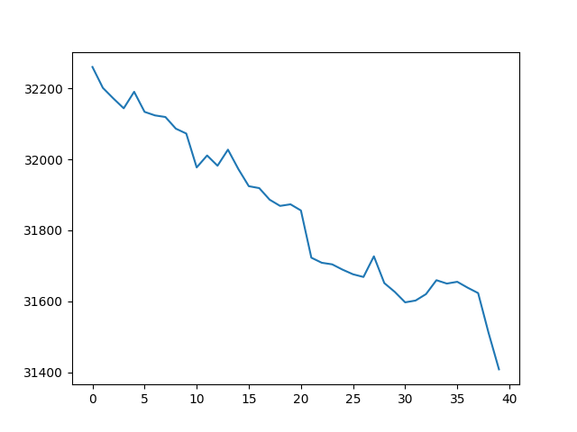
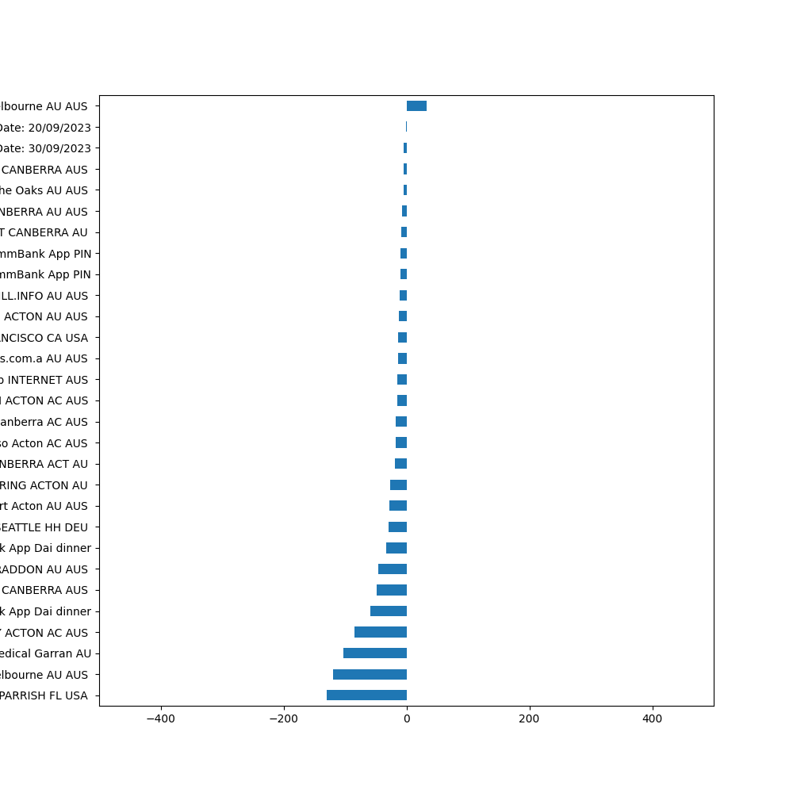

# Dai-toolbox
This is my repo for random thoughts and experimenting with random stuff
Please feel free to have a look
## BankBillVisualisation
Still trying to figure out about your spending every month? Try to visualise your monthly spent on the BankVisualisatio Tool.
Download your spending last month in csv on Common Wealth Bank and run
```
python3 ./process.py [your csv file].csv
```
You will get graphs like




